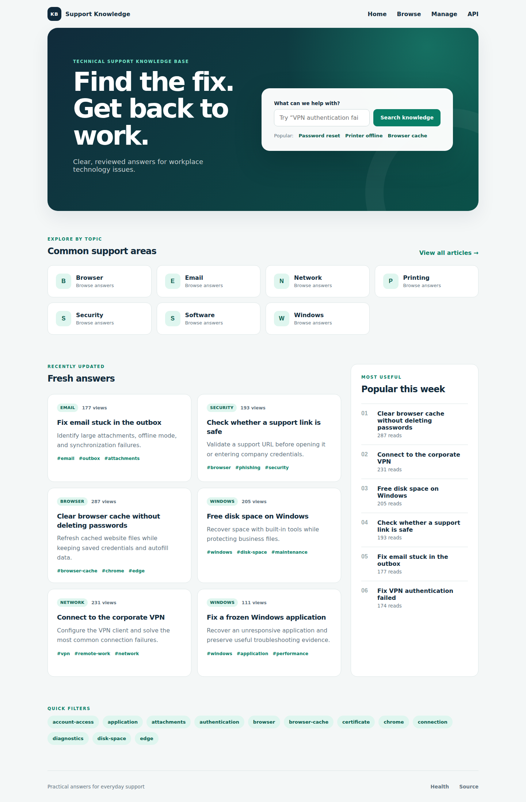
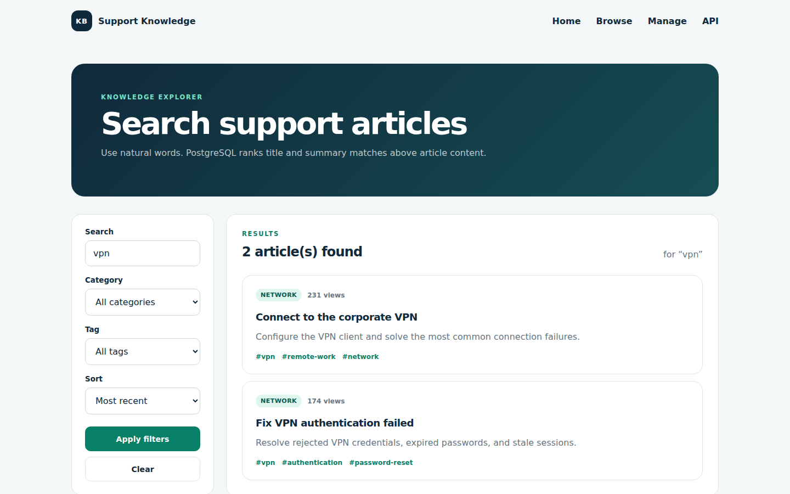
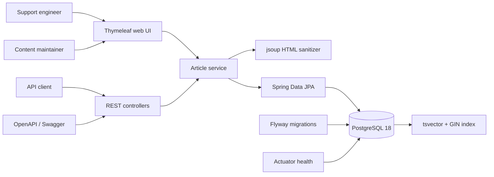
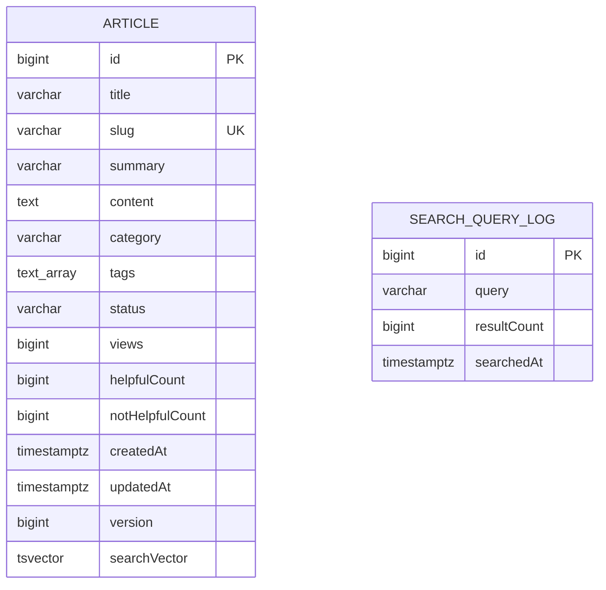

# Support Knowledge Base

[](https://github.com/German4341374/support-knowledge-base/actions/workflows/ci.yml)
[](pom.xml)
[](pom.xml)
[](LICENSE)

Support Knowledge Base is a small searchable catalog for technical support teams. It turns repeated Windows, VPN, printer, Wi-Fi, browser, software, and email questions into reviewed, reusable answers.

The project combines a responsive Thymeleaf interface with a REST API, PostgreSQL-native full-text search, explicit publishing workflows, safe HTML sanitization, migrations, and real database integration tests.

## Features

- Create and edit draft articles.
- Publish or unpublish content without deleting its history.
- Browse published articles by category or tag.
- Search title, summary, category, tags, and article content.
- Rank matches using weighted PostgreSQL relevance.
- Navigate paginated result sets and sort non-search listings by date or popularity.
- Display related articles from the same category.
- Count article views and Helpful / Not Helpful feedback.
- Show popular articles.
- Record recent search queries that returned no results.
- Explore the REST API through Swagger/OpenAPI.
- Monitor the application and PostgreSQL connection through `/actuator/health`.
- Start a reproducible local stack through Docker Compose.

The scope intentionally excludes users, comments, WYSIWYG editing, email, and external search systems.

## Screenshots

### Knowledge home



### Ranked search results



The CI pipeline recreates these UI previews from the running Docker Compose stack.

## Architecture



The application is a modular monolith. HTTP controllers focus on input/output, `ArticleService` owns workflows, and repositories isolate persistence. PostgreSQL performs search ranking; no article corpus is copied to another system.

See [docs/architecture.md](docs/architecture.md) for decisions and trade-offs.

## Data model



`version` provides optimistic locking for concurrent edits. The search vector is maintained by a PostgreSQL trigger and is not mapped as mutable application state.

## Search implementation

PostgreSQL builds a weighted `tsvector` whenever searchable article fields change:

| Weight | Fields | Reason |
|---|---|---|
| A | title | Strongest signal of article intent |
| B | summary, category, tags | Useful routing and topic signals |
| C | sanitized content | Detailed instructions with lower ranking weight |

Queries use `websearch_to_tsquery('english', ...)`, which accepts familiar words, quoted phrases, and exclusions. A GIN index supports the match operation, while `ts_rank_cd` orders results by relevance. Only `PUBLISHED` rows are searchable.

Category and tag predicates can be combined with full-text search. Search requests with zero matches are stored in `search_query_logs`, allowing maintainers to identify missing documentation. See [docs/search.md](docs/search.md) for SQL details.

## Technology

- Java 25 LTS
- Spring Boot 4.1.0
- Spring MVC, Validation, Data JPA, Thymeleaf, and Actuator
- PostgreSQL 18.4
- Flyway
- springdoc-openapi 3.0.3
- jsoup 1.22.2
- JUnit 5, AssertJ, Mockito, and Testcontainers 1.21.4
- Maven Wrapper 3.9.16 and Spotless
- Docker, Docker Compose, Trivy, and GitHub Actions

Important application, build, action, and container versions are pinned. Container base images are pinned by multi-architecture digest.

## Prerequisites

For the simplest workflow:

- Docker Engine 24+;
- Docker Compose v2.

For host-side Java development:

- Java 25;
- Docker, because repository and controller integration tests use Testcontainers;
- no system Maven installation is required.

Windows development is supported through Docker Desktop with Linux containers, either from PowerShell or WSL2.

## Docker setup

Copy the example configuration and change the local password if desired:

```bash
cp .env.example .env
docker compose up --build --detach
docker compose ps
```

Open:

- UI: `http://localhost:8080`
- Search: `http://localhost:8080/search`
- Management: `http://localhost:8080/manage/articles`
- Swagger: `http://localhost:8080/swagger`
- Health: `http://localhost:8080/actuator/health`

Verify:

```bash
curl --fail http://localhost:8080/actuator/health
curl --fail "http://localhost:8080/api/articles?query=vpn"
```

Follow logs and stop the stack:

```bash
docker compose logs --follow app
docker compose down
```

PostgreSQL data remains in the `postgres_data` named volume. Use `docker compose down --volumes` only when the database should be permanently removed.

The default credentials are development-only placeholders. `.env` is ignored and must never be committed.

## Local Java setup

Start only PostgreSQL:

```bash
cp .env.example .env
docker compose up --detach database
./mvnw spring-boot:run -Dspring-boot.run.profiles=dev
```

On Windows PowerShell:

```powershell
Copy-Item .env.example .env
docker compose up --detach database
.\mvnw.cmd spring-boot:run "-Dspring-boot.run.profiles=dev"
```

Flyway applies the schema and inserts 20 deterministic demonstration articles. Nineteen are published and one remains a draft to demonstrate the content lifecycle.

## REST API

| Method | Route | Purpose |
|---|---|---|
| `GET` | `/api/articles` | Search/filter published articles |
| `GET` | `/api/articles/{slug}` | Read an article, increment views, return related content |
| `POST` | `/api/articles` | Create a draft |
| `PUT` | `/api/articles/{id}` | Edit an article |
| `POST` | `/api/articles/{id}/publish` | Publish an article |
| `POST` | `/api/articles/{id}/unpublish` | Return an article to draft |
| `POST` | `/api/articles/{id}/feedback` | Record Helpful / Not Helpful |
| `GET` | `/api/articles/popular` | List popular content |
| `GET` | `/api/articles/categories` | List published categories |
| `GET` | `/api/articles/tags` | List published tags |
| `GET` | `/api/search-analytics/no-results` | List recent zero-result searches |
| `GET` | `/actuator/health` | Application and database health |
| `GET` | `/v3/api-docs` | OpenAPI JSON |

### Search

```bash
curl "http://localhost:8080/api/articles?query=VPN%20authentication&category=Network&page=0&size=10"
```

### Create and publish

```bash
curl --request POST http://localhost:8080/api/articles \
  --header "Content-Type: application/json" \
  --data '{
    "title": "Resolve proxy authentication errors",
    "summary": "Verify network and proxy settings before escalating.",
    "content": "<h2>Checks</h2><ol><li>Confirm the network.</li><li>Retry once.</li></ol>",
    "category": "Network",
    "tags": ["proxy", "authentication"]
  }'

curl --request POST http://localhost:8080/api/articles/21/publish
```

### Feedback

```bash
curl --request POST http://localhost:8080/api/articles/1/feedback \
  --header "Content-Type: application/json" \
  --data '{"helpful":true}'
```

Invalid input, missing articles, and uniqueness conflicts use RFC 9457 Problem Details JSON.

## HTML safety

Article content accepts a limited subset of HTML. jsoup sanitizes content before persistence:

- headings, paragraphs, lists, tables, links, code, and basic emphasis are retained;
- scripts, images, inline styles, event handlers, and unsafe URL schemes are removed;
- output is rendered with Thymeleaf `th:utext` only after sanitization.

This is intentionally simpler than a WYSIWYG editor and makes the security boundary explicit.

## Tests

Run formatting, unit tests, repository tests, controller integration tests, and packaging:

```bash
./mvnw spotless:check
./mvnw verify
```

Windows:

```powershell
.\mvnw.cmd spotless:check
.\mvnw.cmd verify
```

Test groups:

- `SlugServiceTest` verifies normalized and collision-safe slugs.
- `HtmlSanitizerTest` verifies allowed formatting and unsafe HTML removal.
- `ArticleServiceTest` verifies workflow behavior and zero-result analytics.
- `ArticleRepositoryTest` uses real PostgreSQL to verify migrations, seed data, search ranking, publication filtering, arrays, and tags.
- `ControllerIntegrationTest` starts the complete HTTP application against Testcontainers PostgreSQL.

When Docker is unavailable, Testcontainers suites are reported as skipped rather than replaced with a different database. GitHub Actions runs them with Docker.

## CI

The GitHub Actions pipeline has read-only repository permissions and concurrency cancellation. It:

1. provisions Java 25 with a Maven dependency cache;
2. verifies Spotless formatting;
3. runs all unit and Testcontainers tests;
4. packages the Spring Boot application;
5. uploads test reports;
6. scans the repository with Trivy;
7. builds the multi-stage non-root container;
8. scans the final image for fixable HIGH and CRITICAL vulnerabilities;
9. starts the Docker Compose stack;
10. verifies health and PostgreSQL search;
11. captures UI preview artifacts.

Dependabot checks Maven, Docker, and GitHub Actions dependencies weekly.

## Security considerations

- There is deliberately no authentication. Do not expose the management routes directly to the public internet.
- Keep the application on a trusted network or behind an authenticated TLS reverse proxy.
- Use unique production database credentials through environment variables or a secret manager.
- Search analytics may contain user-entered terms. Establish a retention policy and tell users not to enter credentials or personal data.
- Actuator exposes only health and info, with health details hidden.
- The runtime image uses a numeric non-root user; Compose drops Linux capabilities, enables `no-new-privileges`, and uses a read-only root filesystem.
- Compose exposes the application through an edge network while PostgreSQL remains isolated on an internal backend network.

See [SECURITY.md](SECURITY.md) and [docs/operations.md](docs/operations.md).

## Limitations

- No authentication, roles, users, or per-article permissions.
- No comments, revisions, attachments, or WYSIWYG editor.
- English stemming is configured for the demonstration corpus.
- Related articles use category similarity rather than semantic embeddings.
- View and feedback counters are simple database updates, not analytics-grade event streams.
- The application does not redirect old slugs after a title change.
- PostgreSQL is required; H2 or another substitute is intentionally not used for tests.

## Future improvements

- Add a dedicated authenticated reverse-proxy example.
- Add article revision history and preview links.
- Add language-specific search configurations.
- Add search analytics retention and aggregation.
- Add cursor pagination for very large catalogs.
- Add content quality checks for headings, step length, and broken links.
- Sign released container images and publish an SBOM.

## License

Licensed under the [MIT License](LICENSE).
